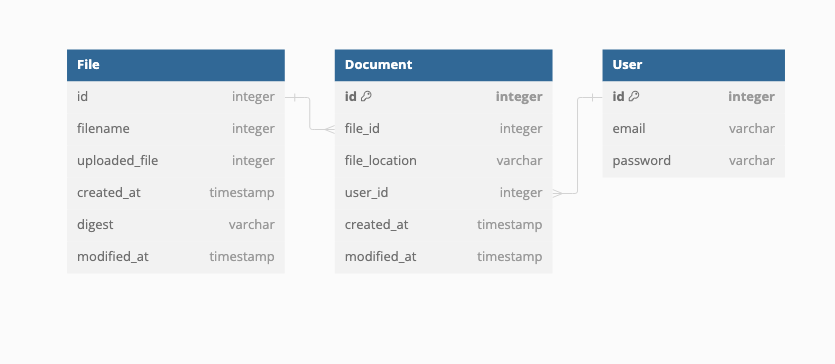

##Introduction
Document manager is a small service which manages your documents. Implement a web application that allows users to store, at later retrieve, files at a specified URL.
The application should be composed of two distinct components - frontend JavaScript
application, and a backend API.
Your assessment should be based on the Propylon Document Management Assessment
bootstrap project found here:
https://github.com/propylon/document-manager-assessment

##Objective
The main objective is to implement the backend.

##Requirements

####Functional
- Stores files of any type and name
- Stores files at any URL
- Does not allow interaction by non-authenticated users
- Does not allow a user to access files submitted by another user
- Allows users to store multiple revisions of the same file at the same URL
- Allows users to fetch any revision of any file
- Demonstrate functionality that allows a client to retrieve any given version of document
using a endpoint that implements a Content Addressable Storage mechanism.
  
####Non-functional
- Demonstrate knowledge of best-practices in relation to unit testing.
- Clear documentation detailing how to build and run the frontend and backend.

####Stretch
- Demonstrate basic read/write permissions enforcement on individual versions of
documents.
- Create a UI for viewing differences in content between file versions.

## Proposed Solution

## DB Schema


## API Reference

#### Swagger UI
```http
  GET /api/schema/swagger-ui/
```

#### Get token

```http
  POST /auth-token/
```
The API returns a token which can be used to access other APIs. All APIs are protected by Token Authentication.

#### Upload Documents/files

```http
  POST /api/documents/
```
The API is used to upload files. It requires a file to upload and, a file location where user wants to upload the file. User can use this file location to later download the file at this location.

#### Download Documents/files

```http
  GET /api/documents/<file_location>
```
The API is used to download a file. By default, it returns the latest version of the file but client can request any version and revision of the file by passing either version or revision of the file.
These are control by query parameters:
```
revision=0 will return the original version of the file.
version=<version id> will return a specific version of the file
```

#### Get list of Documents/files

```http
  GET /api/documents/
```
The API is used to download a list all the documents and its details of a user. User can use file-location query parameter to get all the versions of a document.

## Optimizations

Following optimization can be performed:
### Security
- Restrict the file name to allow certain characters
- Restrict the type of file that can be upload
- Restrict upload size
- Run a malware scan on each file
- Use a different workflow where the file does not hit your server at all instead gets uploaded on to another server where it will get scanned and then use event trigger to update metadata on the database.
- Implement OAuth model for authentication and Authorisation

###Performance
- Add pagination to the list endpoint
- Use Async functions more
- Add more typing 

## Enhancements
Following enhancements are made to the project:

- Automated API Docs Generation (Swagger and Redoc)
- Docker and Docker compose Support added
- Ruff for faster formatting and linting of code
- Poetry for better package management

## Authors

- [@zeeshan](https://github.com/asgarzee)


